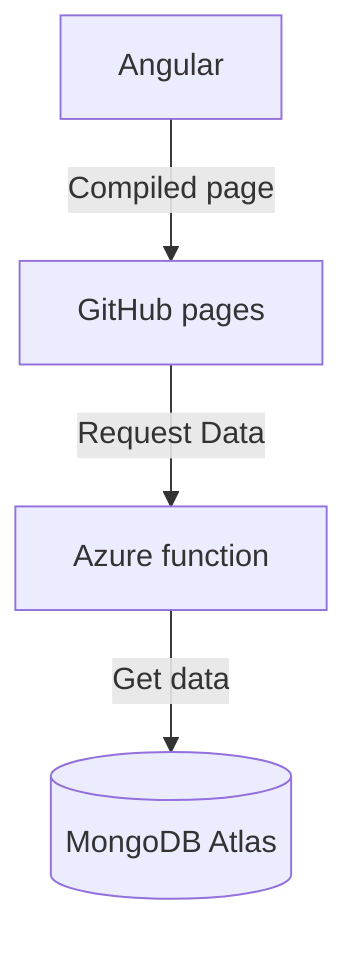

# Tix movie library

A simplified movie library from [Netix](https://github.com/winqus/NETIX).

Data visualized in movie library can be access from [here](https://github.com/prust/wikipedia-movie-data/blob/master/movies.json).

Access movie library [here](https://stebis-dev.github.io/Tix/).

## Conceptual system architecture



## Setup local Azure functions development

1. Inside `\azure` directory install dependencies:

   ```sh
   cd azure
   npm install
   ```
2. Set up environment variables for local Azure function development:
   In `local.settings.json` add the following variables:

   ```json
   {
     "IsEncrypted": false,
     "Values": {
       ...
       "DB_CONN_STRING": "mongo_db_connections_string",
       "DB_NAME": "mongo_db_name",
       "COLLECTION_NAME": "mongo_db_collection_name"
     }
   }
   ```
3. Start the server:

   ```sh
   npm start
   ```


### API Documentation

#### Get Movies

**URL:** `/v1/movies?page=1&limit=10`

**Method:** `GET`

**Query Parameters:**

- `page` (optional): The page number for pagination (default: 1).
- `limit` (optional): The number of movies per page (default: 10).

**Response:**

```json
{
  "page": 1,
  "limit": 10,
  "totalPages": 5,
  "totalMovies": 50,
  "movies": [
    {
      "_id": "60c72b2f9b1d8e1a4c8b4567",
      "title": "Inception",
      "year": 2010,
      "genre": "Sci-Fi"
    },
    ...
  ]
}
```

#### Get Movie by ID

**URL:** `/v1/movies/{id}`

**Method:** `GET`

**Path Parameters:**

- `id`: The ID of the movie to retrieve.

**Response:**

```json
{
  "_id": "60c72b2f9b1d8e1a4c8b4567",
  "title": "Inception",
  "year": 2010,
  "genre": "Sci-Fi"
}
```

#### Search Movies

**URL:** `/v1/library/search?name=`

**Method:** `GET`

**Query Parameters:**

- `name` (required): The name of the movie to search for.
- `page` (optional): The page number for pagination (default: 1).
- `limit` (optional): The number of movies per page (default: 10).

**Response:**

```json
{
  "page": 1,
  "limit": 10,
  "totalPages": 1,
  "totalMovies": 1,
  "movies": [
    {
      "_id": "60c72b2f9b1d8e1a4c8b4567",
      "title": "Inception",
      "year": 2010,
      "genre": "Sci-Fi"
    }
  ]
}
```

## Import data to Atlas MongoDB from local Docker container
Export the data from the database into a BSON file
```cmd
docker exec -it <container name> mongodump --db test --out /tmp/dump 
```
Copy the data to your local machine
```cmd
docker cp mongodb-modern-db:/tmp/dump ./dump
```
Send the data to the Atlas cluster database
```cmd
mongorestore --uri  mongodb+srv://<cluster-account-username>:<cluster-account-password>@<cluser-name>.ifx3o.mongodb.net ./<bson file>
```


